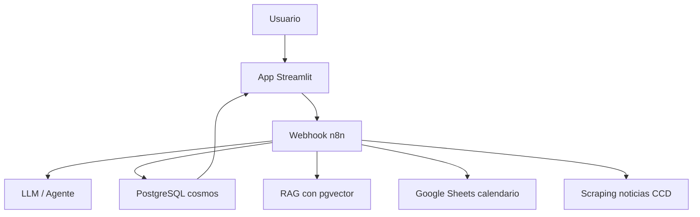

# Chatbot Inteligente CCD UNAB

Demo para el proyecto de Ciencia de Datos del Centro de Competencias Digitales.
La solución combina una app visual en Streamlit, PostgreSQL para consultas académicas
y n8n como orquestador del chatbot con RAG, calendario y scraping.

## Arquitectura



## Componentes

- `streamlit_app.py`: interfaz visual tipo chat y panel de consultas.
- `ccd_queries.py`: consultas SQL tomadas del notebook del profesor.
- PostgreSQL `cosmos`: tablas `estudiante`, `catalogo_materias_ccd`,
  `cursos_estudiantes`, `registro_nota`, `oferta` y vista `progreso_estudiante`.
- n8n: workflows para RAG, calendario, progreso académico y noticias.

## Instalación local

1. Crea un entorno virtual.
2. Instala dependencias:

```bash
pip install -r requirements.txt
```

3. Copia `.env.example` como `.env` y completa las credenciales.

4. Ejecuta la app:

```bash
streamlit run streamlit_app.py
```

## Workflows sugeridos en n8n

### Workflow 1: Consulta general RAG

Entrada:

```json
{
  "message": "¿Qué es la insignia de competencias digitales?",
  "student_id": "20230004"
}
```

Pasos:

1. Webhook `POST /webhook/ccd-chat`.
2. Clasificar intención: general CCD, progreso, calendario, oferta o noticias.
3. Para intención general, buscar fragmentos en `pgvector`.
4. Enviar contexto al LLM.
5. Responder JSON:

```json
{
  "answer": "La insignia de competencias digitales certifica..."
}
```

### Workflow 2: Progreso del estudiante

1. Webhook recibe `student_id`.
2. Nodo PostgreSQL consulta `progreso_estudiante`.
3. Nodo Function formatea pilares completados, aprobados y faltantes.
4. LLM redacta respuesta personalizada.

Query base:

```sql
SELECT
    e.id_estudiante,
    e.nombre_completo,
    e.programa_academico,
    e.anio_ingreso,
    CASE WHEN e.anio_ingreso >= 2025 THEN 'Nuevo' ELSE 'Antiguo' END AS plan,
    pe.pilar1_cumplido,
    pe.pilar2_cumplido,
    pe.pilar3_cumplido,
    pe.cursos_aprobados,
    pe.cursos_faltantes
FROM progreso_estudiante pe
JOIN estudiante e ON e.id_estudiante = pe.id_estudiante
WHERE pe.id_estudiante = $1;
```

### Workflow 3: Calendario

1. Detectar preguntas como "¿cuándo es la prueba diagnóstica?".
2. Leer Google Sheets con columnas `evento` y `fecha`.
3. Filtrar por evento.
4. Responder con fecha y detalle.

### Workflow 4: Noticias y cursos nuevos

1. Cron diario.
2. HTTP Request al sitio del CCD.
3. HTML Extract para títulos, fechas y enlaces.
4. Guardar cambios en PostgreSQL.
5. El chatbot consulta esa tabla cuando el usuario pregunta por novedades.

## Preguntas de demostración

- ¿Qué cursos debo tomar en competencias digitales?
- ¿Qué cursos he aprobado?
- ¿Qué me falta para completar la ruta?
- ¿Qué cursos hay en Analítica y Contenido Digital?
- ¿Cuándo es la prueba diagnóstica?
- ¿Hay nuevos cursos disponibles?

## Entregables cubiertos

- Arquitectura del sistema.
- Base de datos PostgreSQL.
- App visual.
- Workflows n8n documentados.
- Consultas académicas.
- Base para RAG y scraping.
